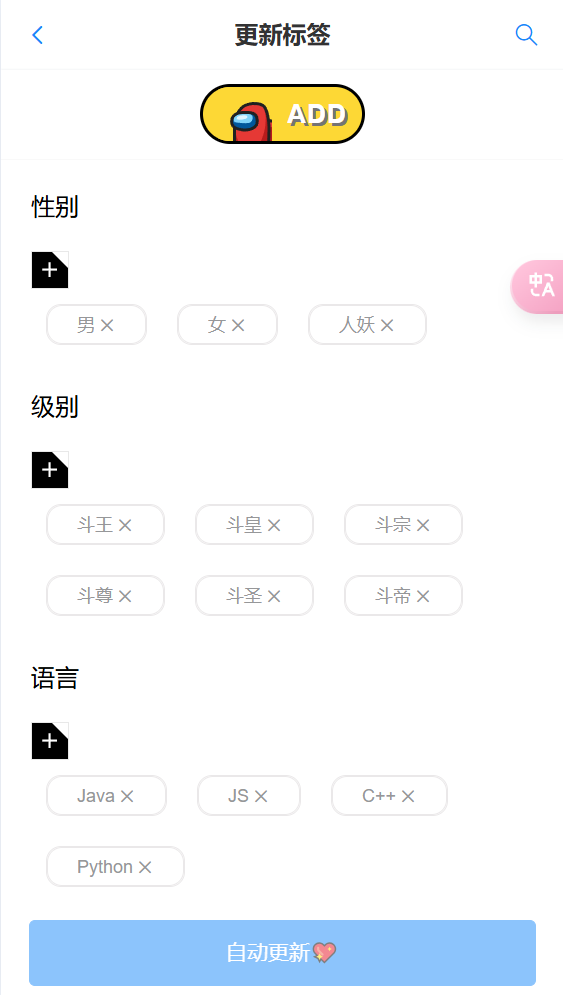

# 伙伴匹配系统

## 1、项目介绍

这是一个伙伴匹配系统，项目主要的功能就是让更多的用户可以找到与自己志同道合的伙伴。


### 1-1、项目架构 

#### 1-1-1、技术栈: 

1. 前端:
   1. Vue3 + Vant4 + pinia + Vue-Router等前端主流技术
2. 后端: 
   1. SpringBoot2 +  MyBatis Plus + Redis + Knife4j


#### 1-1-2、数据库设计

- 设计了用户信息表、标签表、用户标签关联表等，以支持高效的标签匹配和伙伴搜索功能。
- 对频繁查询的数据字段设置索引，提高查询速度。


#### 1-1-3、接口与安全架构

- 提供开放的 API 接口，支持伙伴搜索、标签管理等功能。采用基于 JWT 的身份认证，保障数据安全。
- 数据传输采用 HTTPS 协议，确保用户隐私信息在网络传输中的安全性。


#### 1-1-4、**接口设计**

介绍系统中对外开放的 API 接口，接口调用方式、参数说明、认证机制、响应格式等。


### 2、性能优化

为提高用户体验和系统性能，采取了以下优化措施：

1. **Redis 缓存与分布式锁**：
   - **缓存预热**：对热门数据进行缓存预热，避免缓存穿透问题，减少数据库的直接访问压力。
   - **分布式锁**：使用 Redis 分布式锁来防止高并发情况下的重复匹配请求，保证数据的一致性。
2. **智能匹配算法**：
   - **编辑距离算法（Levenshtein Distance）**：在用户标签匹配上引入了编辑距离算法，使系统能够根据标签的相似度为用户推荐更精准的伙伴。通过动态计算标签间的编辑距离，可以识别出较为接近的兴趣标签，从而为用户提供更高质量的匹配结果。
3. **异步与延迟加载**：
   - 针对后台定时任务、批量操作等耗时任务，使用异步处理，避免阻塞用户请求。
   - 针对用户首次访问的数据，采用延迟加载的策略，减少前端页面加载时间。


## 2、项目启动

```bash
yarn install

yarn dev
```


## 3、演示效果图展示

### 3-1、登录模块


### 3-2、注册模块


### 3-3、主页

#### 3-3-1、普通模式


#### 3-3-2、心动模式 

采用 详解编辑距离算法-Levenshtein Distance

[文档](https://blog.csdn.net/DBC_121/article/details/104198838)


### 3-4、私聊

#### 3-4-1、好友列表


#### 3-4-2、好友申请


#### 3-4-3、聊天模式


### 3-5-队伍 【过期的队伍，不会进行展示】

#### 3-5-1、队伍列表


#### 3-5-2、创建队伍


#### 3-5-3、加密小队


### 3-6、搜索模块

#### 3-6-1、搜索小队


#### 3-6-2、搜索标签


### 3-7、个人中心

#### 3-7-1、个人中心


#### 3-7-2、修改信息


#### 3-7-3、创建的队伍


#### 3-7-4、加入的队伍


#### 3-7-5、修改标签【仅管理员可更新】

 

